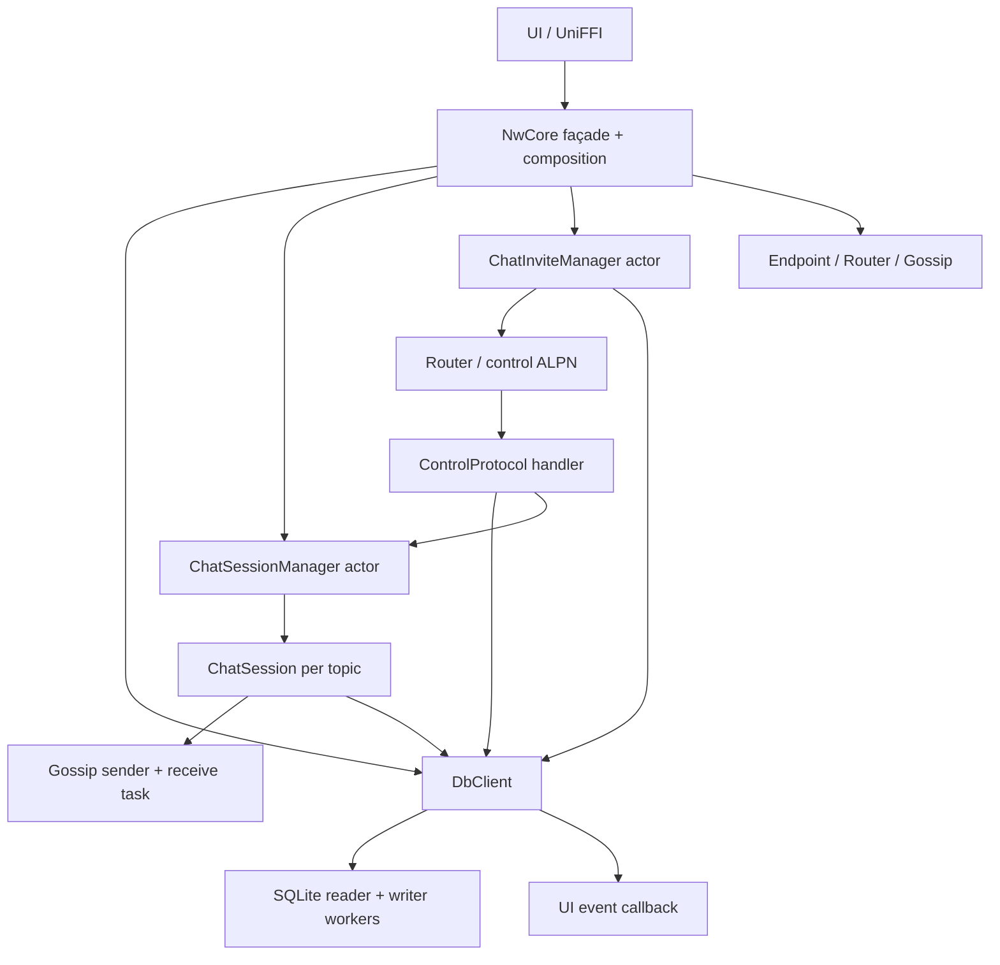
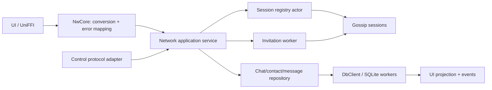

# Networking architecture: current shape and a cleaner direction

## Purpose and scope

This is an architecture review of the current Rust networking path, not a proposed bug fix. It focuses on responsibility boundaries, ownership, and why the current clone patterns feel hard to reason about. The main code reviewed is `rust-core/src/network/core/mod.rs`, the group-chat session manager and session, the control protocol and invite manager, and the database client/manager.

## Executive summary

The project already has several sensible building blocks: a UniFFI-facing `NwCore`, a serialized actor for chat sessions, one `ChatSession` per gossip topic, a separate inbound control protocol, an invitation retry/reconciliation loop, and database workers behind a cloneable client handle.

The main issue is not the raw number of `.clone()` calls. Many clones are cheap handles or intentional snapshots. The real source of architectural friction is that **ownership and responsibilities are split across objects without a single clearly defined application-level workflow boundary**:

- `NwCore` converts UI values, creates domain state, reads profile data, and coordinates two managers.
- `ChatSessionManager` owns active sessions, but also persists chats and reads the initial chat list.
- `ChatSession` handles gossip, message signing/verification, receive-task lifecycle, and message persistence.
- `ControlProtocol` handles wire decoding, sender lookup, invite normalization, persistence, session activation, and acknowledgment.
- `ChatInviteManager` reconciles database state, chooses pending invites, sends protocol requests, and updates member state.
- `DbClient` is both a storage API and, through generated writes, a source of UI notifications; its public API mixes UI projections and network-domain records.

The cleanest direction is to keep the useful actor/session structure, but make the application workflows explicit. Treat `NwCore` as a thin FFI façade, introduce one internal networking/application service to own use cases, keep transport handlers focused on the wire, and make persistence calls flow through a small repository boundary. Avoid adding layers that merely forward calls: each new boundary should have one clear owner and a testable reason to exist.

## What exists today

### 1. FFI façade and composition root

`NwCore` is exported through UniFFI. It owns the Tokio runtime, a `DbClient`, the session manager, and the invite manager. Its constructor creates a runtime, reads the profile, binds an Iroh endpoint, builds Gossip and Router, starts the managers, and keeps the runtime alive. The exported `create_chat` and `send_message` methods are synchronous and perform UI-to-network conversion at the boundary. See [network/core/mod.rs](rust-core/src/network/core/mod.rs#L29-L172).

This is currently both the public API and the composition root. That can work, but it makes the FFI-facing type also look like the owner of application workflow decisions.

### 2. Chat session actor and per-chat session

`ChatSessionManager` is a cloneable mpsc sender. Its spawned task owns a map from topic ID to `ChatSession` and serializes `Add` and `SendMessage` commands. On startup it loads chats from the database. On `Add`, it starts the gossip subscription, installs the session, and writes the chat to the database. See [groupchat/manager.rs](rust-core/src/network/groupchat/manager.rs#L14-L71).

Each `ChatSession` owns a gossip sender and receive-task handle, and aborts that receive task when dropped. It builds bootstrap IDs from chat membership, starts a receive loop, signs and broadcasts outgoing messages, and writes outgoing/incoming messages to the database. See [groupchat/session.rs](rust-core/src/network/groupchat/session.rs#L16-L132).

The actor is a useful serialization point. The unclear part is that “session management” currently includes storage and startup hydration, while the individual session combines transport, message processing, and persistence.

### 3. Control protocol and invite workflow

`ControlProtocol` accepts an Iroh connection, looks up the sender, decodes a `ChatInvite`, rewrites the local member entry, persists the chat, asks the session manager to activate it, and sends the response. See [control_protocol/mod.rs](rust-core/src/network/control_protocol/mod.rs#L27-L88).

`ChatInviteManager` is another actor. It periodically reloads chats, derives pending invites, sends them through the Router, and marks members joined after an accepted response. `NwCore::create_chat` can also request an immediate refresh. See [control_protocol/chat_invite.rs](rust-core/src/network/control_protocol/chat_invite.rs#L17-L111) and [network/core/mod.rs](rust-core/src/network/core/mod.rs#L57-L93).

The split into inbound protocol handling and outbound invite work is reasonable. Their current responsibilities overlap around chat persistence and membership status, and both depend directly on `DbClient`.

### 4. Database boundary

`DbManager` owns the SQLite worker threads and produces `DbClient` values. `DbClient` is a cloneable pair of Tokio mpsc senders; requests and results are passed through channels. The generated API includes network records, UI projections, synchronous and asynchronous variants, and UI event emission for selected writes. See [database/manager.rs](rust-core/src/database/manager.rs#L29-L40) and [database/client.rs](rust-core/src/database/client.rs#L16-L63), [database/client.rs](rust-core/src/database/client.rs#L118-L162).

The database is intentionally isolated behind a client, but the API is not fully storage-neutral: it imports both `network` and `ui` models, and writes can emit UI events. That means the storage boundary also participates in application presentation/reactivity.

## Why all the clones?

It helps to distinguish clones by what they represent:

| Clone category | Examples | What it means | Architectural concern |
| --- | --- | --- | --- |
| Shared capability/handle | `DbClient`, manager senders, endpoint/router/gossip handles | Another owner can send requests or use a shared runtime resource. These are generally the right shape for actor-based systems and are not equivalent to copying all underlying state. | Low by itself. Make lifecycle/authority clear, not clone-free. |
| Immutable configuration/identity | `NwProfile`, including the secret key | A component gets the data it needs to run independently. | Decide whether profiles are snapshots or shared identity state; avoid passing the key to components that do not need it. |
| Domain snapshots | `NwChat` in manager commands and invite reconciliation | A point-in-time value is moved/cloned between asynchronous work. | Can be appropriate, but full chat snapshots are repeatedly copied and it is unclear which copy is authoritative. Prefer IDs plus repository lookup when freshness matters, or move owned values when possible. |
| FFI ownership adaptation | `Arc::unwrap_or_clone` in `NwCore::spawn` | Accommodates UniFFI's shared ownership while constructing an internal value. | A boundary detail; do not redesign the internal architecture around this one line. |

So “remove every clone” is not a good design goal. A better goal is: **make shared handles visibly shared, make snapshots deliberate, and make each mutable/authoritative state have one owner**.

## The key responsibility seams to clean up

### A. Separate startup wiring from the FFI object

Today the `NwCore` constructor does the full network composition and the type retains infrastructure fields. Extracting an internal `NetworkRuntime`/`NetworkNode` would let `NwCore` be a narrow FFI adapter while a Rust-only owner handles endpoint, router, managers, and shutdown. This is primarily a naming/ownership clarification; do not split it into many tiny wrappers.

### B. Give chat use cases one coordinator

Chat creation and inbound acceptance are two entry points into the same broad workflow: validate/build chat state, persist it, activate a session, invite or acknowledge peers, and expose the result. At present, those steps are divided among the FFI façade, protocol handler, invite actor, session manager, and session.

A small internal `ChatService` (or equivalent) should own the application-level operations, such as `create_chat`, `accept_invite`, and `send_message`. It can coordinate a `ChatRepository`, a session registry, and an invite sender. The FFI façade and protocol handler should call those use cases rather than reimplement parts of the workflow. Keep the service small: it should coordinate policy, not become a second god object.

### C. Make the session manager own only live sessions

Keep the actor and its `HashMap<TopicId, ChatSession>` as the single owner of active session state. Move database hydration/persistence decisions to the use-case/service layer. The manager should answer a narrow question: start/stop/send for a topic, with an explicit result. A session should focus on gossip subscription and message transport; message persistence can be coordinated by the service or a message sink/repository dependency rather than hidden in the session implementation.

### D. Make protocol code a transport adapter

The inbound handler should decode the request, validate basic wire-level constraints, call the relevant application use case, and encode the response. It should not own chat persistence policy or know how a session manager is implemented. This keeps transport-specific types and connection details at the edge.

Similarly, outbound invitation delivery can remain an actor/worker, but the policy for membership transitions should live in one use-case boundary. The invitation worker should report outcomes; it should not silently become a second owner of chat lifecycle rules.

### E. Give persistence a cohesive internal API

A `ChatRepository` interface (or a concrete adapter if test needs do not justify a trait) can hide database request details from networking code. The repository owns chat/member/message persistence operations; the database layer owns SQLite mechanics. A future cleanup can also separate UI read models/events from network persistence APIs. This should be incremental: the current `DbClient` channel facade is already useful and does not need to be replaced wholesale.

## A cleaner target shape

Suggested ownership rules:

1. `NwCore` owns the application runtime/service and exposes stable FFI methods. It does input/output conversion and maps errors; it does not implement the workflow.
2. The application service owns chat workflow policy and coordinates persistence, sessions, and invites.
3. The session registry actor is the sole owner of active `ChatSession` values. Its cloneable sender is only a command handle.
4. The protocol adapter owns serialization, connection handling, and wire-level validation only.
5. The repository is the network/application-facing persistence boundary. SQLite workers remain an implementation detail.
6. Persisted records are the durable source of truth; active sessions are runtime state reconstructed from that source. Keep the distinction explicit.
7. Runtime-owning components expose a deliberate shutdown/drop policy. Avoid relying on scattered task aborts and implicit runtime teardown as the only lifecycle contract.

## A practical cleanup sequence

This is deliberately staged so it does not require solving every current behavior bug first.

### Stage 1: Document and name ownership

- Treat `NwCore` explicitly as the FFI façade plus composition root for now.
- Document which component owns the Tokio runtime and which tasks are expected to stop when it is dropped.
- Classify clones in code review as handles versus copied domain values; retain the cheap handle clones.
- Make errors/results visible across actor boundaries rather than relying on actor-side logging for operation failures.

### Stage 2: Extract workflow methods without changing semantics

- Move the bodies/policy of chat creation and invite acceptance into a Rust-only service.
- Keep the current actor and protocol modules, but make them call that service.
- Have the service be the one place that decides the ordering of persistence, session activation, invitation, and acknowledgment.
- Keep `NwCore` focused on mapping `UiContact`/string IDs to internal types and returning FFI-safe results.

### Stage 3: Narrow the component APIs

- Make session registration/send operations explicitly asynchronous internally; keep any required synchronous bridge only at the FFI boundary.
- Remove database loading and chat persistence from `ChatSessionManager` once the service owns those decisions.
- Reduce `ChatSession` state to what it needs for transport; pass a minimal immutable identity/context instead of cloning a whole profile into every session if practical.
- In invite reconciliation, carry topic/member identifiers and load current state when needed rather than retaining cloned full chat snapshots across retries.

### Stage 4: Isolate persistence and UI projection

- Add repository methods around network chat/member/message operations, backed by `DbClient` initially.
- Gradually keep UI-specific records and event emission out of the networking-facing persistence API.
- Add boundary tests for the service using a fake/in-memory repository and session/invite adapters where useful.

## What not to do

- Do not try to make the design “clean” by replacing every clone with `Arc<Mutex<_>>`. That would add shared mutable state and make ownership less obvious.
- Do not add a trait for every concrete type. Introduce interfaces where they isolate a real dependency or enable focused tests.
- Do not make every actor own a copy of all domain state. Prefer one authoritative persisted record and narrow messages/IDs between components.
- Do not combine the session manager, invitation worker, protocol handler, and database into one large manager. Their different lifecycles are useful seams.
- Do not treat this document as confirmation that the current behavior is correct. This review is about boundaries; sequencing, acknowledgment semantics, retries, validation, and recovery still need their own fixes and tests.

## Bottom line

The foundation is not fundamentally chaotic: it already uses sensible actors and per-chat sessions. The cleanness problem is that the same chat workflow crosses too many layers, and components mix runtime ownership with persistence and policy. Keep the actors and the channel-backed `DbClient`; clarify their responsibilities by adding one small application-service boundary, making the session registry own only live sessions, and keeping transport and persistence as adapters. That will make the clones easier to understand because each will clearly be either a cheap handle or an intentional value snapshot.
